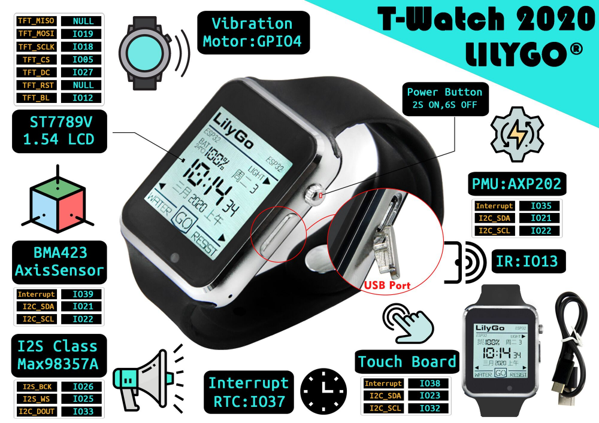

<h3> </h3>

MicroPython for the TTGO T-Watch 2020 v1
=======================
<h2>w/ ST7789 C driver & axp202 driver</h2>

  

<h3> </h3>
<h3>
<A HREF="https://github.com/SilverLogix/MicroPython-T-Watch/releases/tag/v1.1">Latest Update</a>
</h3>